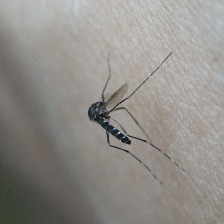

<div align="center">
    <h1>Detector de mosquitos con redes convolucionales</h1>
</div>



<div align="right">
    <h1>Peligroso</h1>
</div>


# Requisitos
Version de python usada: [Python 3.11.9](https://www.python.org/downloads/release/python-3119/)

Librerias mas importantes usadas para el proyecto
|Libreria|Version|
|:---|:---:|
|numpy|1.24.3|
|tensorflow|2.13.0|
|keras|2.13.1|
|matplotlib|3.7.2|

las puedes instalar ejecutando el comando ```pip install -r requirements.txt``` 

## Entorno virtual
Para no modificar la version de python instalada en tu sistma puedes hacer uso de un entorno virtual el cual puedes crear ejecutando el comando

```
python -m venv env
```

para activar el entorno virutal y poder instalar las librerias necesarias ejecuta
```
./env/Scripts/Activate.ps1
```
